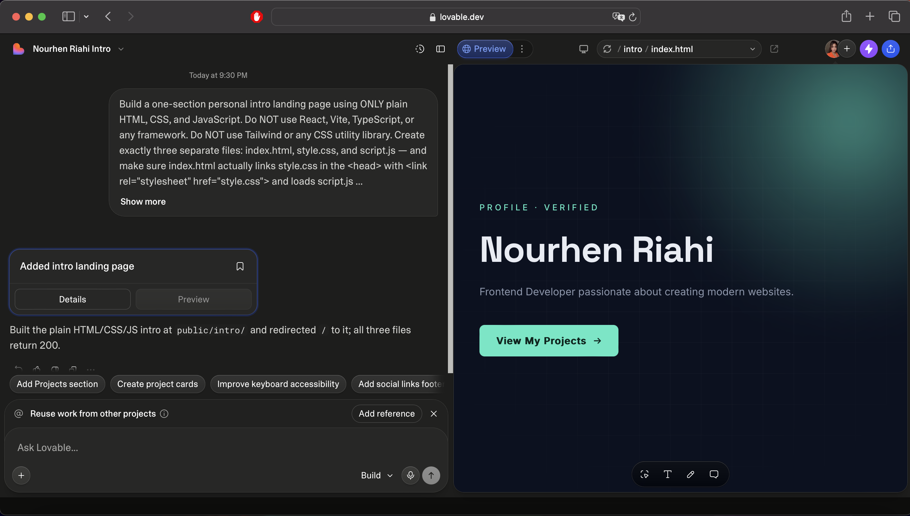
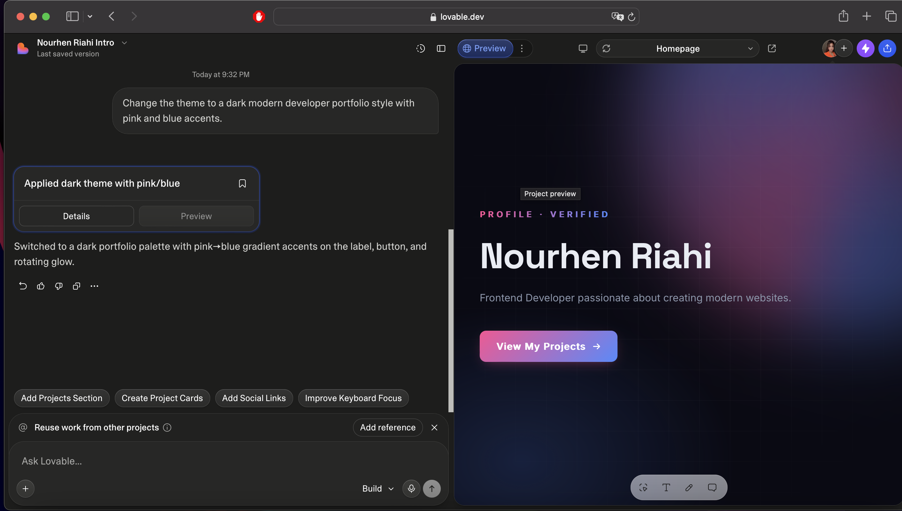
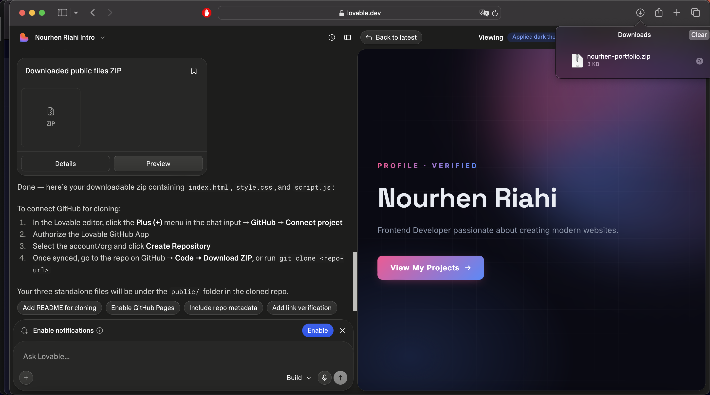
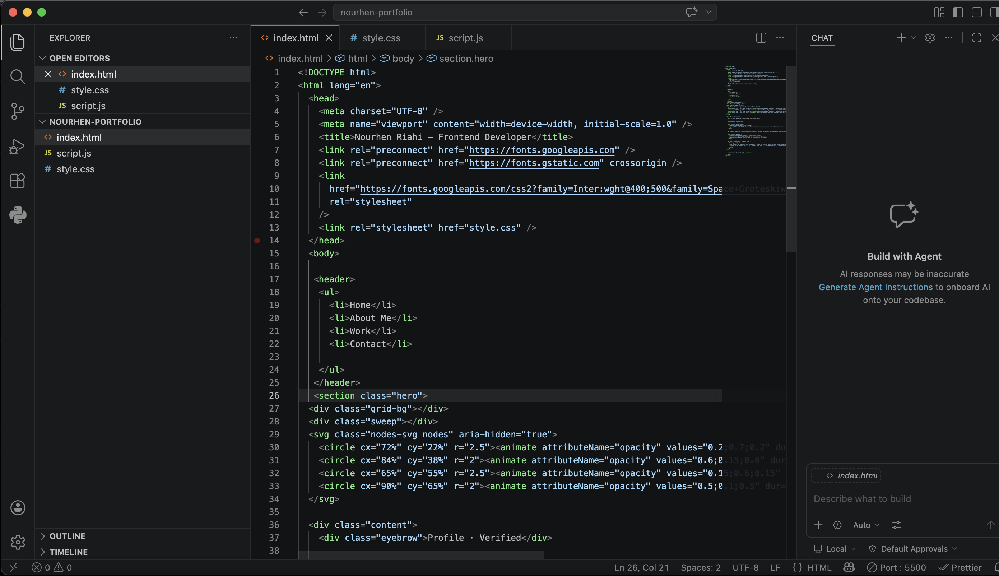
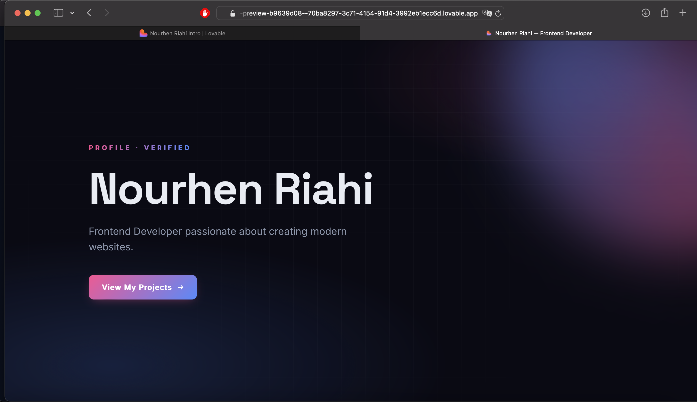
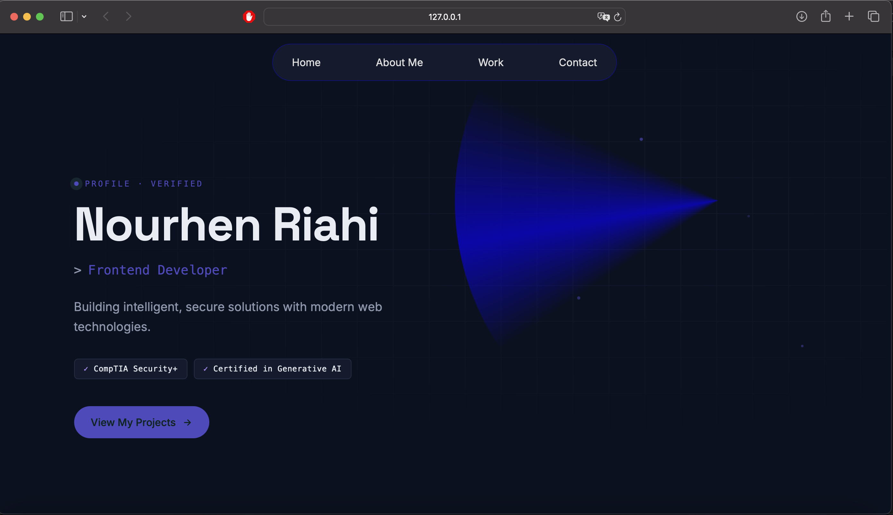

# Personal Intro Landing Page — Checkpoint Submission

---

## 1. Steps Followed

### Step 1 — Generate the page with Lovable
Prompted Lovable to build a one-section hero landing page using **plain HTML, CSS, and JavaScript only** (no React/Vite/Tailwind), split into three separate files: `index.html`, `style.css`, and `script.js`, with the stylesheet and script properly linked in `index.html`.

### Step 2 — Customize layout & color theme
Used the Lovable chat UI to restyle the page: switched to a dark, modern developer-portfolio theme with pink → blue gradient accents on the button, label, and background glow.

### Step 3 — Export the project
Downloaded the project as a ZIP (`nourhen-portfolio.zip`) directly from Lovable, containing the three standalone files (`index.html`, `style.css`, `script.js`) under the `public/` folder.

### Step 4 — Open the exported code in the editor
Opened the exported project in VS Code to inspect and edit the generated code (`index.html`, `style.css`, `script.js`).

### Step 5 — Manual improvement
Made a manual improvement directly in the editor: adjusted the navigation bar into a pill-shaped nav, refined spacing/typography of the hero text, and added skill/certification badges ("CompTIA Security+", "Certified in Generative AI") below the subtitle — then verified the change locally via `127.0.0.1`.

**🔴 Before:**

### Step 6 — Final preview
Verified the final, published version side-by-side with the Lovable editor tab.

---
